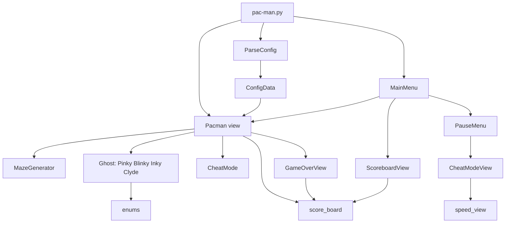

*This project has been created as part of the 42 curriculum by hahchtar, zboualam.*

# Pac-Man

## Description

A Pac-Man game written in Python with the [Arcade](https://api.arcade.academy)
library. The goal of the project is to rebuild the classic game with
procedurally generated mazes, four ghosts with their own behaviour
(Pinky, Blinky, Inky and Clyde), a configurable difficulty, a highscore table
and a few cheat options.

Overview of the game:

- The maze is generated for every level with the provided **A-Maze-ing**
  package (`mazegenerator`), and it gets bigger from level to level.
- Pac-Man eats every pac-gum of the maze to finish a level, before the level
  timer runs out.
- Eating a super pac-gum (in a corner) makes the ghosts edible for a few
  seconds.
- When the game ends, the player enters a name and the score is saved in the
  highscore table.

## Instructions

### Requirements

- Python 3.11 or newer
- [uv](https://docs.astral.sh/uv/) (dependencies: `arcade`, `rich`, and the
  local `mazegenerator` wheel in `wheels/`)

### Installation

```bash
make install        # runs: uv sync
```

### Execution

```bash
make run            # runs: uv run pac-man.py config.json
# or
uv run pac-man.py config.json
```

The config file is the only (and required) argument.

### Linting and type checking

```bash
make lint           # mypy with the strict flags used by the project
uv run flake8 .
```

### Controls

| Key | Action |
|---|---|
| Arrow keys / `W` `A` `S` `D` | Move Pac-Man |
| `Esc` | Pause menu |
| `F` | Toggle fullscreen |
| `Up` / `Down` + `Enter` | Navigate the menus |

The pause menu gives access to the **Cheat Mode** screen: increase speed,
invincibility, level skip, ghost freeze, extra lives, and show the ghosts path.

## Configuration

The game is configured with a JSON file given on the command line. Full-line
comments starting with `#` or `//`, and `/* ... */` blocks, are ignored.
A missing or invalid value never crashes the game: a message is printed and
the default value is used. Only an unreadable file or invalid JSON stops the
program.

| Key | Type | Default | Rule |
|---|---|---|---|
| `highscore_filename` | string | `"track_score.json"` | Must end with `.json`, must not contain `..`, and must not be an absolute path |
| `lives` | int | `3` | Positive integer |
| `pacgum` | int | `42` | Positive integer (read and stored, not used by the gameplay yet) |
| `points_per_pacgum` | int | `1` | Positive integer |
| `points_per_super_pacgum` | int | `50` | Positive integer |
| `points_per_ghost` | int | `200` | Positive integer |
| `seed` | int | `42` | Any integer, used for the maze of level 1 only |
| `level_max_time` | int | `90` | Seconds per level, only used if greater than `90` |
| `levels` | list of `{width, height}` | 10 levels (see below) | `width` and `height` must be integers between `10` and `40` |

Default levels (used when `levels` is missing, or for any invalid entry):

| Level | 1 | 2 | 3 | 4 | 5 | 6 | 7 | 8 | 9 | 10 |
|---|---|---|---|---|---|---|---|---|---|---|
| Size | 10x10 | 25x25 | 29x25 | 29x29 | 33x29 | 33x33 | 37x33 | 37x37 | 41x37 | 41x41 |

Example:

```json
{
    # General settings
    "highscore_filename": "track_score.json",
    "lives": 3,

    # Scoring
    "points_per_pacgum": 1,
    "points_per_super_pacgum": 50,
    "points_per_ghost": 200,

    # Maze generation
    "seed": 42,
    "level_max_time": 90,
    "levels": [
        { "width": 15, "height": 15 },
        { "width": 25, "height": 25 }
    ]
}
```

## Highscore

Scores are stored in a JSON file (`highscore_filename`) as a list of
`{"name": ..., "score": ...}` entries.

How it works:

- When the game ends, the player types a name (1 to 10 letters, numbers or
  spaces). Invalid names are refused.
- Only scores greater than `0` are saved.
- A player name appears once: a new score replaces the old one only if it is
  better.
- The table is sorted from best to worst and keeps the **top 10**.
- The table can be seen from the main menu (**Highscores**) and is shown
  automatically after entering a name.

Why this design:

- A plain JSON file is human readable, needs no database, and is easy to
  reset or inspect.
- Keeping the best score per name and only the top 10 avoids a file that
  grows forever and a table filled by one player.
- The name is validated and the filename is restricted (no `..`, no absolute
  path) so the game can only write inside the project directory.
- If the file is missing or corrupted, it is simply recreated empty.

## Maze Generation

Mazes come from the `MazeGenerator` class of the provided **A-Maze-ing**
package (`wheels/mazegenerator-2.0.2-py3-none-any.whl`, installed by `uv`).

```python
maze = MazeGenerator(seed=seed, size=(width, height))
maze.generate(seed=seed)
grid = maze.maze        # list of rows, each cell is an int
```

- Each cell is an integer where every bit is a **wall**:
  `1` = up, `2` = right, `4` = down, `8` = left.
- A cell equal to `15` is fully closed. These cells (the "42" pattern) are
  drawn as solid blocks and Pac-Man cannot enter them.
- Level 1 uses the `seed` of the config file, so it is reproducible. The
  following levels use a random seed.
- The size of each level comes from the `levels` list of the config file.
- Pac-Man starts in the center of the maze, and the ghosts start in the
  corners. The corner cells hold the super pac-gums.

## Implementation

- **Rendering and loop:** the game uses Arcade `View`s (`Pacman`, `MainMenu`,
  `PauseMenu`, `GameOverView`, `ScoreboardView`, `CheatModeView`,
  `speed_view`). Each view implements `on_draw`, `on_update` and
  `on_key_press`.
- **Movement:** the maze is a grid and every cell has a pixel position.
  Pac-Man and the ghosts move smoothly from cell to cell, and a new direction
  is only taken when the character is centered on a cell and no wall blocks it.
- **Level progress:** a level ends when Pac-Man has visited every free cell.
  The next level generates a bigger maze. After the last level the player wins.
- **Lives:** when a ghost catches Pac-Man a life is lost, the game freezes for
  a short time, then Pac-Man respawns with a few seconds of invincibility.
- **Ghosts:** every ghost inherits from the abstract class `Ghost` and
  implements `get_path`. The shared logic (BFS shortest path, random move,
  run away) lives in `Ghost`.

| Ghost | Start | Delay | Behaviour |
|---|---|---|---|
| Pinky | top-left | 0 s | Moves randomly, avoiding the cells it just left |
| Inky | bottom-right | 3 s | Targets a cell computed from Pac-Man's position and Blinky's position |
| Blinky | top-right | 6 s | Chases Pac-Man with a BFS, aiming one cell ahead of him |
| Clyde | bottom-left | 9 s | Chases Pac-Man when far, goes back to its corner when close |

- Ghosts never share a target cell and avoid their last cells, so they spread
  in the maze instead of stacking.
- **Edible mode:** after a super pac-gum, ghosts turn blue and run away to the
  cell farthest from Pac-Man (BFS distance). An eaten ghost disappears and
  respawns in its corner after 5 seconds.
- **Config parsing:** `ParseConfig` strips the comments, loads the JSON,
  validates every key, and builds a `ConfigData` dataclass.
- **Code quality:** the code is typed (`mypy --strict` passes) and follows
  flake8 (79 columns).

## General Software Architecture

```
pac-man.py            entry point
src/
├── __init__.py        exports ParseConfig, Pacman, MainMenu
├── load_config.py     ParseConfig, ConfigData
├── pacman.py          Pacman (game view), Point, CheatMode
├── ghosts_algorithm.py Ghost (abstract), Pinky, Blinky, Inky, Clyde
├── main_menu.py       MainMenu, PauseMenu, GameOverView, ScoreboardView
├── speed_screen.py    CheatModeView, speed_view
├── score_tracker.py   score_board
└── enums.py           directions, moves, Ghost_modes
```



- `pac-man.py` parses the config, creates the `Pacman` game view and opens the
  `MainMenu`.
- `Pacman` owns the maze, the ghosts, the score, the lives and the cheat flags.
  The menus and the cheat screens read and change its state.
- `score_board` is the only class that reads or writes the highscore file.

## Resources

- [Arcade documentation](https://api.arcade.academy)
- [Python documentation](https://docs.python.org/3/)
- [The Pac-Man Dossier](https://pacman.holenet.info/) (ghost behaviour of the original game)
- [Breadth-first search](https://en.wikipedia.org/wiki/Breadth-first_search)
- [uv documentation](https://docs.astral.sh/uv/)
- [mypy documentation](https://mypy.readthedocs.io/) and [flake8 documentation](https://flake8.pycqa.org/)
- [JSON specification](https://www.json.org/)

### Use of AI

AI (Claude) was used for:

- Fixing the `flake8` and `mypy` errors of the Python files: adding type
  annotations, docstrings and reformatting. The game logic was not changed,
  and the result was checked by comparing the code structure with the original.
- Drafting this README, from the project source code.


## Project Management

[Describe in a few lines how the team organised the work: roles, task split,
meetings, tools (Git branches, issues, board...), and how the work was
tracked.]

Project management directory: [project_management/](project_management/)